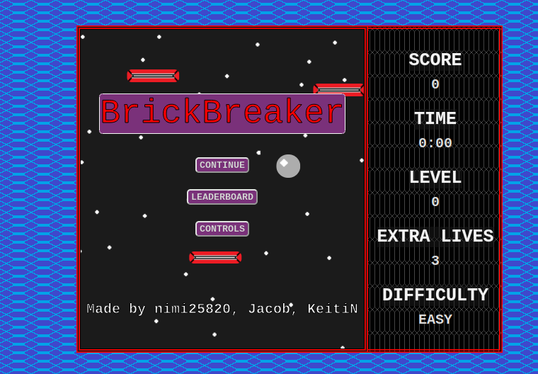
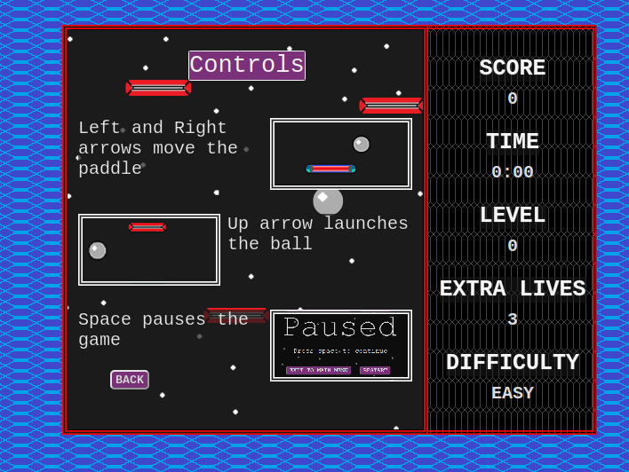
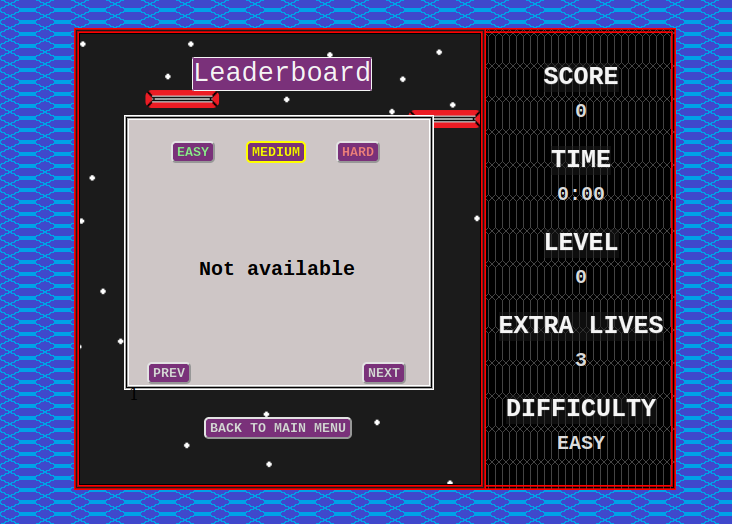
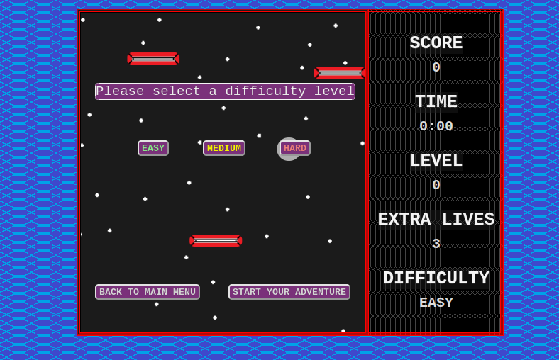
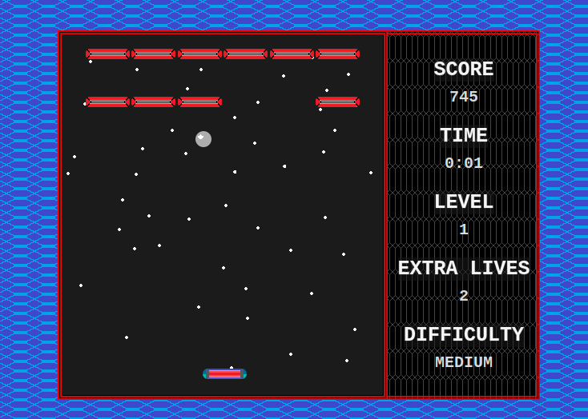
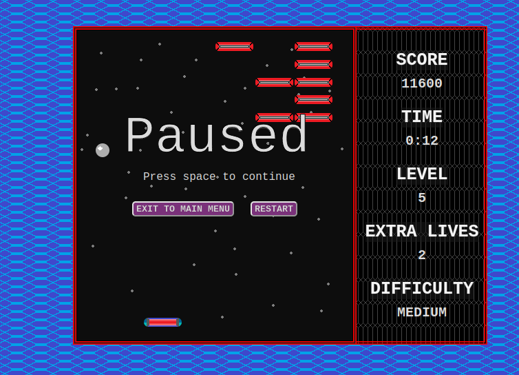
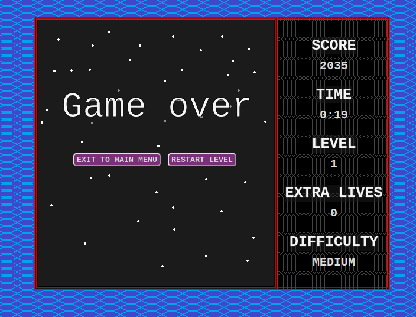
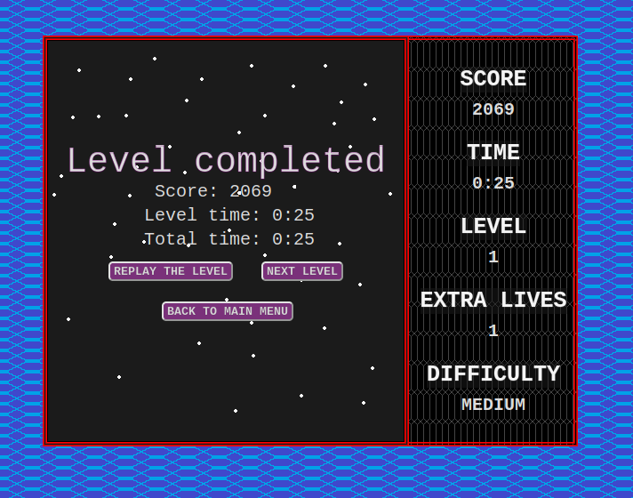
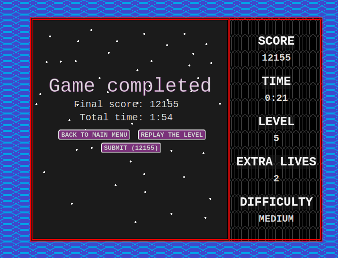

# brick-breaker

## Table of Contents
- [brick-breaker](#brick-breaker)
  - [Table of Contents](#table-of-contents)
  - [General Information](#general-information)
  - [Features](#features)
  - [Technologies Used](#technologies-used)
  - [Team \& My Work](#team--my-work)
  - [Main Learnings](#main-learnings)
  - [Setup](#setup)
  - [Images](#images)

## General Information
This project was made as a school project in [kood/Jõhvi](https://kood.tech/) (03.20.2022)

The project required us to recreate one of the many legacy games. We chose BrickBreaker.

## Features
- 3 different difficulties
- Keyboard controls
- Cool UI
- Leaderboard

## Technologies Used

[Golang](https://go.dev/)

[JavaScript](https://www.javascript.com/)

## Team & My Work
In this project I was in a team of 3 with 2 other students from kood/Jõhvi.

I was responsible for:
  - The overall lifecycle of the game
  - UI/UX Design
  - Making the main game loop
  - CRUD Golang API
  - Source code structure
  - Most of the client-side code

## Main Learnings
- Game loop
- Basics of UX\UI design
- CRUD API
- Structured source code
- Basics of JavaScript
- Basics of DOM

## Setup
Clone the repository
```
git clone https://github.com/JesusKris/brick-breaker.git
```
Run the server
```
go run server.go
```

## Images









